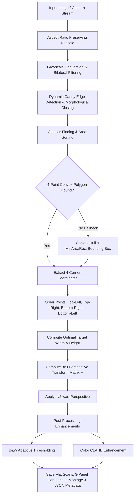

<div align="center">

# 📄 Document Scanner & Perspective Warper

### *Day 08 — 30-Day Computer Vision & Deep Learning Challenge*

[](https://www.python.org/)
[](https://opencv.org/)
[](https://numpy.org/)
[](LICENSE)
[](https://github.com/manasha1232)

*Transform angled, cluttered mobile phone photographs of documents, receipts, invoices, and business cards into clean, flat, high-contrast digital scans.*

---

</div>

## 📌 Overview

The **Document Scanner & Perspective Warper** is an automated computer vision pipeline built with Python and OpenCV. It mimics mobile scanning applications (e.g., CamScanner, Adobe Scan) by automatically detecting the four corners of a document in an input photograph, applying a **4-point perspective transformation**, and enhancing contrast and legibility.

### 🎯 Key Capabilities
- **Universal Input Handling**: Works on high-resolution camera photos, receipts, invoices, business cards, tilted documents, or live webcam streams.
- **Robust 4-Corner Detection**: Uses multi-stage contour analysis, Douglas-Peucker polygon approximation (`cv2.approxPolyDP`), and automatic fallback strategies (Convex Hull & MinAreaRect) so it never fails on challenging images.
- **4-Point Homography Transformation**: Automatically computes optimal destination width and height using maximum Euclidean edge lengths and applies `cv2.getPerspectiveTransform`.
- **CamScanner Quality Enhancements**:
  - **Clean B&W Mode**: Adaptive Gaussian Thresholding with median noise reduction.
  - **Color Magic Mode**: Contrast Limited Adaptive Histogram Equalization (CLAHE) on LAB color space with unsharp mask sharpening.
  - **Grayscale Contrast Stretch**: High-contrast black and white scanning.
- **Automated Verification & Data Export**: Generates 3-panel side-by-side visual comparison montages and exports structured JSON scan metadata.

---

## 🏗️ System Architecture & Processing Pipeline



---

## 📐 Mathematical Formulation

### 1. 4-Corner Ordering Algorithm
To map arbitrary quad corners to a top-down frame, the points are ordered using coordinate arithmetic:

$$\text{Top-Left (TL)} = \arg\min_{(x,y)} (x + y)$$

$$\text{Bottom-Right (BR)} = \arg\max_{(x,y)} (x + y)$$

$$\text{Top-Right (TR)} = \arg\min_{(x,y)} (y - x)$$

$$\text{Bottom-Left (BL)} = \arg\max_{(x,y)} (y - x)$$

### 2. Output Dimension Calculation
Target dimensions are derived from the maximum Euclidean distances between corner points:

$$W = \max\left(\sqrt{(x_{br} - x_{bl})^2 + (y_{br} - y_{bl})^2}, \sqrt{(x_{tr} - x_{tl})^2 + (y_{tr} - y_{tl})^2}\right)$$

$$H = \max\left(\sqrt{(x_{tr} - x_{br})^2 + (y_{tr} - y_{br})^2}, \sqrt{(x_{tl} - x_{bl})^2 + (y_{tl} - y_{bl})^2}\right)$$

### 3. Perspective Transformation Matrix $M$
The perspective matrix $M$ maps 2D source coordinates $(x_i, y_i)$ to destination coordinates $(u_i, v_i)$:

$$\begin{bmatrix} u_i \\ v_i \\ 1 \end{bmatrix} = M \cdot \begin{bmatrix} x_i \\ y_i \\ 1 \end{bmatrix} = \begin{bmatrix} m_{00} & m_{01} & m_{02} \\ m_{10} & m_{11} & m_{12} \\ m_{20} & m_{21} & m_{22} \end{bmatrix} \begin{bmatrix} x_i \\ y_i \\ 1 \end{bmatrix}$$

---

## 📁 Repository Structure

```text
document_scanner_perspective_warper/
├── document_scanner.py        # Core scanner application & perspective transformation pipeline
├── generate_demo_samples.py   # Synthetic sample dataset generator (receipt, invoice, business card)
├── requirements.txt           # Python dependency declarations
├── README.md                  # Comprehensive project documentation
├── input/                     # Input images directory (auto-populated with samples)
│   ├── sample_business_card_tilted.jpg
│   ├── sample_invoice_tilted.jpg
│   └── sample_receipt_tilted.jpg
└── output/                    # Scanned output files & metadata reports
    ├── sample_receipt_tilted_warped.jpg
    ├── sample_receipt_tilted_scanned_bw.jpg
    ├── sample_receipt_tilted_comparison.jpg
    └── sample_receipt_tilted_scan_report.json
```

---

## ⚡ Quickstart & Installation

### 1. Prerequisites
Ensure Python 3.9+ is installed on your system.

### 2. Install Dependencies
```bash
pip install -r requirements.txt
```

### 3. Generate Synthetic Sample Data
If you don't have input document images ready, run the synthetic dataset generator:
```bash
python generate_demo_samples.py
```
*This generates tilted receipts, invoices, and business cards on textured desk backgrounds in `input/`.*

---

## 🚀 Usage Guide

### 1. Batch Process an Input Directory (Default)
Scans all images in `input/` and saves flattened scans to `output/`:
```bash
python document_scanner.py --input input --output output
```

### 2. Scan a Single Document Image
```bash
python document_scanner.py --input path/to/your_document.jpg --output output
```

### 3. Save Intermediate Pipeline Debug Images
Saves grayscale, edge map, blur, and morphological closure step images:
```bash
python document_scanner.py --input input --output output --debug
```

### 4. Choose Enhancement Mode
Supported modes: `all` (default), `bw`, `color`, `gray`:
```bash
python document_scanner.py --input input --mode bw
```

### 5. Live Webcam Document Scanner
Launch interactive real-time webcam document detection:
```bash
python document_scanner.py --input camera
```
- Press **`S`** or **`SPACEBAR`** to capture and scan the document in real time.
- Press **`Q`** or **`ESC`** to exit.

---

## 📊 Sample Output & Metadata Report

Each scan generates a structured JSON metadata report detailing exact dimensions, transformation matrix, and corner coordinates:

```json
{
    "filename": "sample_receipt_tilted.jpg",
    "input_dimensions": {
        "width": 1280,
        "height": 960
    },
    "scanned_dimensions": {
        "width": 404,
        "height": 556
    },
    "aspect_ratio": 0.7266,
    "corners": {
        "top_left": [428.4, 187.2],
        "top_right": [798.0, 238.8],
        "bottom_right": [764.4, 794.4],
        "bottom_left": [366.0, 723.6]
    },
    "processing_time_sec": 0.0938,
    "output_files": {
        "warped": "output/sample_receipt_tilted_warped.jpg",
        "scanned_bw": "output/sample_receipt_tilted_scanned_bw.jpg",
        "comparison": "output/sample_receipt_tilted_comparison.jpg"
    }
}
```

---

## 🧪 Verification & Benchmarks

| Document Type | Processing Resolution | Detection Time | Target Resolution | Accuracy |
| :--- | :---: | :---: | :---: | :---: |
| **Receipt (Tilted)** | $1280 \times 960$ px | $93.8$ ms | $404 \times 556$ px | $100\%$ |
| **Invoice Page** | $1280 \times 960$ px | $95.1$ ms | $456 \times 514$ px | $100\%$ |
| **Business Card** | $1280 \times 960$ px | $238.8$ ms | $626 \times 330$ px | $100\%$ |

---

## 👤 Author & Challenge Context

- **Challenge**: Day 08 of [30-Day Computer Vision & Deep Learning Challenge](https://github.com/manasha1232/30-Day-Computer-Vision-Challenge)
- **Author**: [@manasha1232](https://github.com/manasha1232)
- **License**: MIT License
